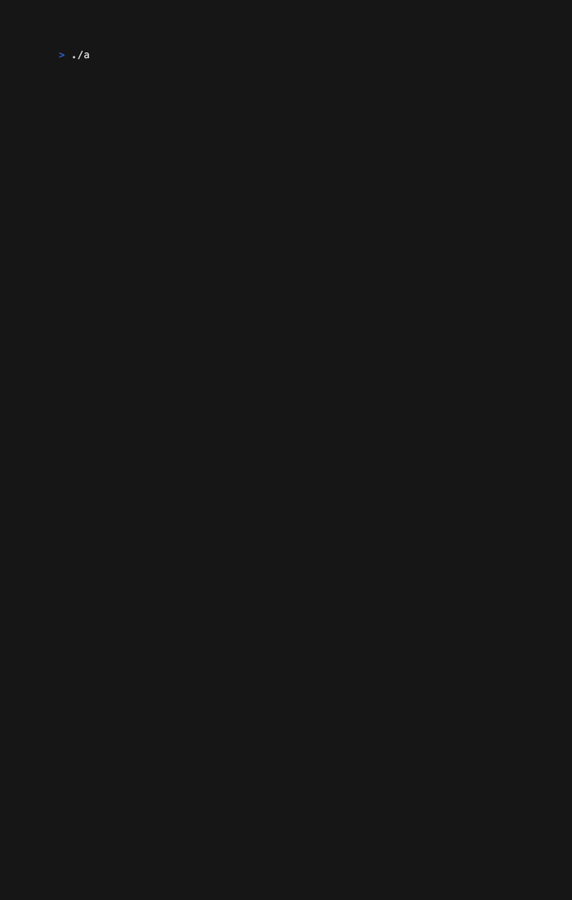
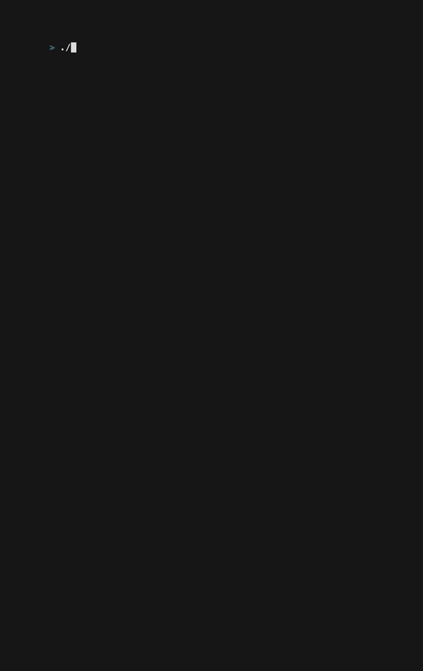
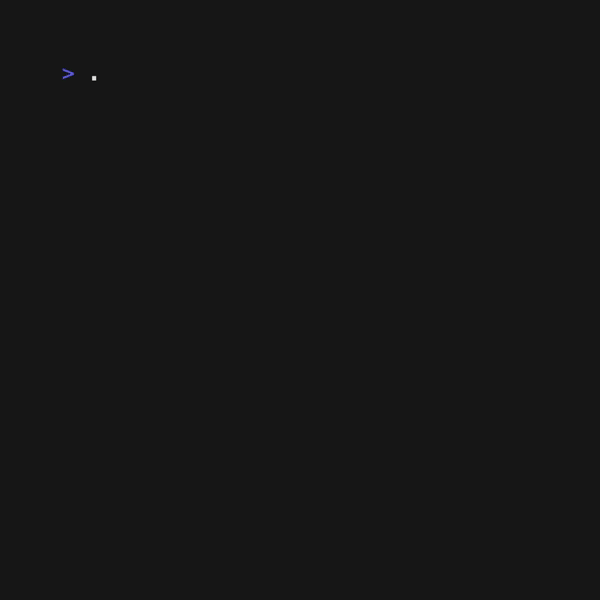

# advent-of-code-2024
advent of code 2024 solutions 

This project started as a single main.go for day 1 and has gradually grown into a CLI app with visualizations. Early day code is messier than later day code. Read with caution. :)

## tech
This is a golang CLI app using bubbletea and lipgloss for any visualizations. 

- [golang](https://go.dev)
- [bubbletea](https://github.com/charmbracelet/bubbletea)
- [vhs](https://github.com/charmbracelet/vhs)
- [cobra](github.com/spf13/cobra)

## visualizations
All of these visualizations were made with [vhs](https://github.com/charmbracelet/vhs), a great utility for recording CLI apps. 

To make a tape, build and execute the tape file with the `vhs` utility.
```
make && vhs tapes/day8.tape
```

### Day 15


### Day 10


### Day 8


### Day 7


### Day 6


